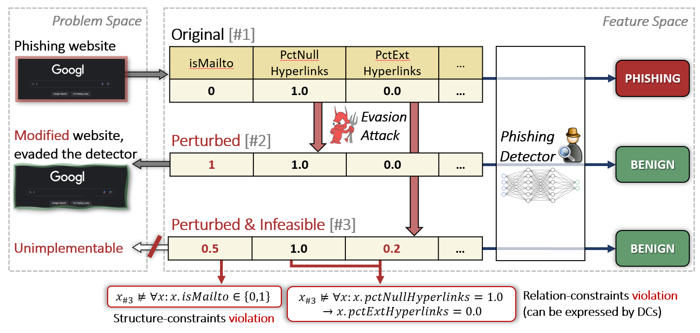

# Adversarial Example Attacks on Tabular Data
The official repository of [Cost aware Feasible Attack (CaFA) on Tabular Data](TODO-LINK). It provides a modular, clean and 
accessible implementation of CaFA and its variants, complying with [Adversarial Robustness Toolbox framework](https://github.com/Trusted-AI/adversarial-robustness-toolbox/tree/main). 
Thus, it allows: transparity of technical details of our work, 
reproduction of major experiments in the paper, extension of the work, 
and utilizing the attack for practical means (e.g., evaluation of models).

<div align="center">

</div>

## What is CaFA?
CaFA is an _Adversarial Example_ attack, suited for tabular data. That is, given a set of samples and a classification 
ML-model, CaFA crafts malicious inputs--based on the original ones--that are misclassified by the model.

CaFA is composed on 3 main logical components:
1. **Mine:** employing a constraints mining algorithm (we use [FastADC](https://github.com/RangerShaw/FastADC) and our own ranking scheme) on a 
portion of the dataset; we focus on [Denial Constraints](https://dl.acm.org/doi/10.14778/2536258.2536262).
2. **Peturb:** attacking the model with *TabPGD* (a [PGD](https://arxiv.org/abs/1706.06083) variation we propose to attack tabular data) and *TabCWL0*
(a variation of [Carlini-Wagner](https://arxiv.org/abs/1608.04644)'s attack) to craft adversarial examples under structure constraints and cost limitations.
3. **Project:** the crafted samples are then projected onto the constrained space embodied by the constraints 
learned in the first step. For this end we use a SAT solver ([Z3 Theorem Prover](https://github.com/Z3Prover/z3))


## Setup
The project requires `Python 3.8` and on, and `Java 11` and on (to run `FastADC`). Additionally, 
the installation of `pip install -r requirements.txt` is required (preferably in an isolated `venv`).

## Usage
To run the attack use:
```bash
python attack.py data=<dataset_name>
```
The attack's components can be enabled/disabled/modify through the configuration dir (`config/`). 
These components include:
- `data`: the dataset to preprocess, train on, attack and mine constraints from.
- `ml_model`: the ML model to load/train and target as part of the attack.
- `attack`: the attack's (CaFA) parameters. 
- `constraints`: the specification of the utilized constraints, their mining process and whether to incorporate 
projection; in this these are Denial Constraints.


## Datasets
We evaluate on three commonly used tabular datasets:
[Adult](https://archive.ics.uci.edu/ml/datasets/adult) and 
[Bank Marketing](https://archive.ics.uci.edu/dataset/222/bank+marketing), and
[Phishing Websites](https://archive.ics.uci.edu/ml/datasets/phishing+websites). 


## Citation
[TODO]

## License
[TODO]