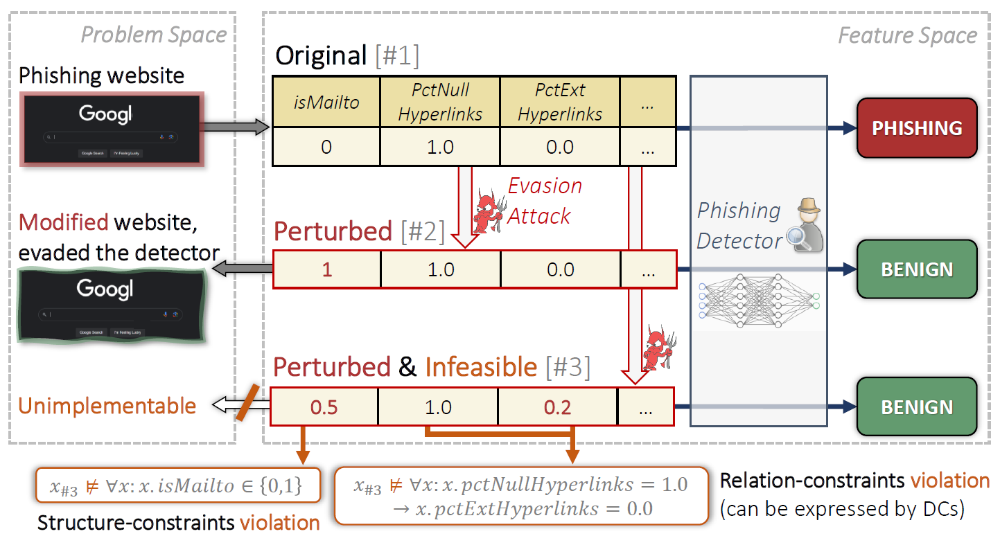

# AI-CYBERSECURITYPROJECT..CAFA. "" THIS IS MY COLLEGE PROJEC REPOSITORY FOR AI &CYVERSECURIY PROJECT

# Adversarial Example Attacks on Tabular Data
The official repository of [Cost aware Feasible Attack (CaFA) on Tabular Data](TODO-LINK). It provides a modular, clean and 
accessible implementation of CaFA and its variants, complying with [Adversarial Robustness Toolbox framework](https://github.com/Trusted-AI/adversarial-robustness-toolbox/tree/main). 
Thus, it allows: transparency of technical details of our work, future extension of the work and utilizing the attack for practical means (e.g., evaluation of models' robustness).

<div align="center">

</div>


#  Cost-aware Feasible Adversarial Attacks on Neural Tabular Classifiers (CaFA)

This repository contains an implementation of **Cost-aware Feasible Adversarial Attacks (CaFA)**, a method for generating adversarial examples on tabular datasets while respecting real-world data integrity constraints.  
This implementation reproduces the core ideas from the **Oakland 2024 paper** [*CaFA: Cost-aware Feasible Adversarial Attacks on Neural Tabular Classifiers*](https://github.com/matanbt/attack-tabular).

---
## What is CaFA?
CaFA is an _Adversarial Example_ attack, suited for tabular data. That is, given a set of samples and a classification 
ML-model, CaFA crafts malicious inputs--based on the original ones--that are misclassified by the model.

CaFA is composed of 3 main logical components:
1. **Mine:** employing a constraints mining algorithm (we use [FastADC](https://github.com/RangerShaw/FastADC) and our ranking scheme) on a 
portion of the dataset; we focus on [Denial Constraints](https://dl.acm.org/doi/10.14778/2536258.2536262).
2. **Perturb:** attacking the model with *TabPGD* (a [PGD](https://arxiv.org/abs/1706.06083) variation we propose to attack tabular data) and *TabCWL0*
(a variation of [Carlini-Wagner](https://arxiv.org/abs/1608.04644)'s attack) to craft adversarial examples under structure constraints and cost limitations.
3. **Project:** The crafted samples are then projected onto the constrained space embodied by the constraints 
learned in the first step. For this end we use a SAT solver ([Z3 Theorem Prover](https://github.com/Z3Prover/z3)).

## 📑 Project Overview

Adversarial attacks on tabular data present unique challenges since each record must remain feasible under domain-specific rules (e.g., age ≥ 0, income categories, etc.).  
**CaFA** tackles this by:
- **Automatically mining Denial Constraints (DCs)** from training data
- Applying a **modified PGD attack (TabPGD)** tailored to tabular models
- Using a **SAT solver to project adversarial samples back into the feasible data space**

This project extends the original implementation by:
- Adding **dynamic visualizations of misclassification rates, L0, and Linf attack costs**
- Automating result plotting after each attack run
- Handling dynamic result directory creation and visualization retrieval

---


## Datasets
We evaluate on three commonly used tabular datasets:
[Adult](https://archive.ics.uci.edu/ml/datasets/adult) and 
[Bank Marketing](https://archive.ics.uci.edu/dataset/222/bank+marketing), and
[Phishing Websites](https://archive.ics.uci.edu/ml/datasets/phishing+websites). 

Additional tabular datasets can be added following the same structure and format as the existing ones; that is, it is requried to provide the attack with the data itself, its structure and optionally the mined constraints (see: `config/data/`). 

## 📂 Project Structure
```
├── attack.py                         # Main attack runner script
├── config/                           # Hydra config files
├── data/                             # Data directory (Adult, COMPAS, Credit datasets)
├── outputs/                          # Auto-generated attack outputs (with metrics & logs)
├── plots/                            # Generated metric comparison plots
├── src/                              # Source code (models, attacks, constraints, utilities)
├── requirements.txt                  # Python dependencies
├── README.md                         # This file
└── LICENSE
```


## Steps of Implementation 
1. clone the repository 
   
2. Create and activate a virtual environment:
    python3 -m venv venv
    
    source venv/bin/activate
    
3. Install dependencies:
   
     pip install -r requirements.txt
   
   please install matplotlib "" pip install matlplotlib""
4. Running the Attack: To run the default CaFA attack on the Adult dataset:
   
     python attack.py
   
Attack artifacts and evaluation metrics will be saved under outputs/<date>/<run-time>/.


5. Visualizing Attack Metrics: After running an attack, generate performance visualizations:
   
       python plot_misclassification_rates.py
   
This script will automatically:
Locate the latest output folder Parse evaluations.json
Generate a grouped bar chart comparing:
Misclassification rates
Feasible success rates
L0 and Linf costs before/after attack and projection
**Plots are saved to the plots/ directory.**


## RESULT :


